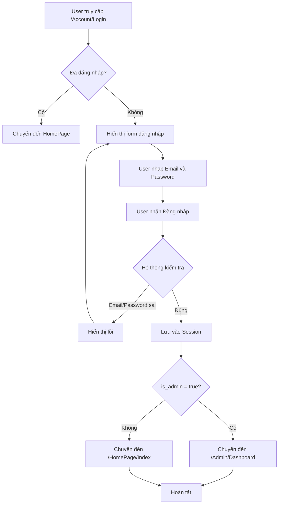
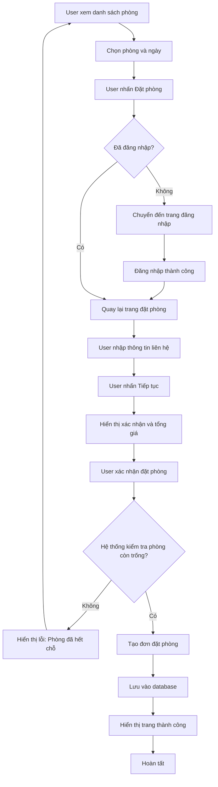
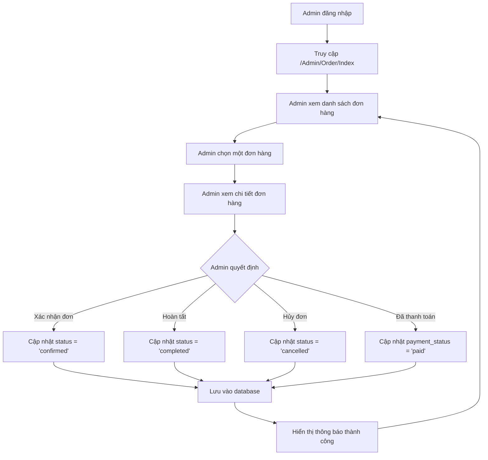
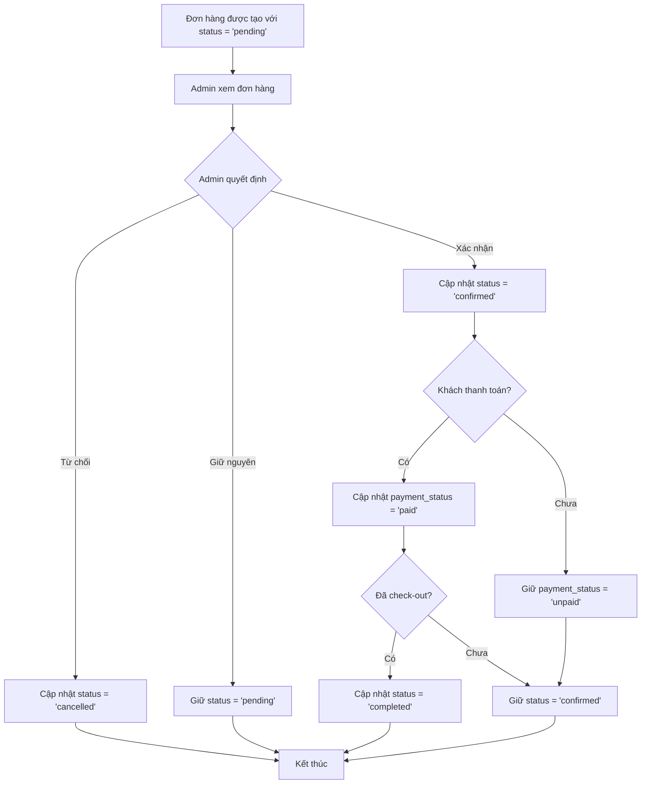
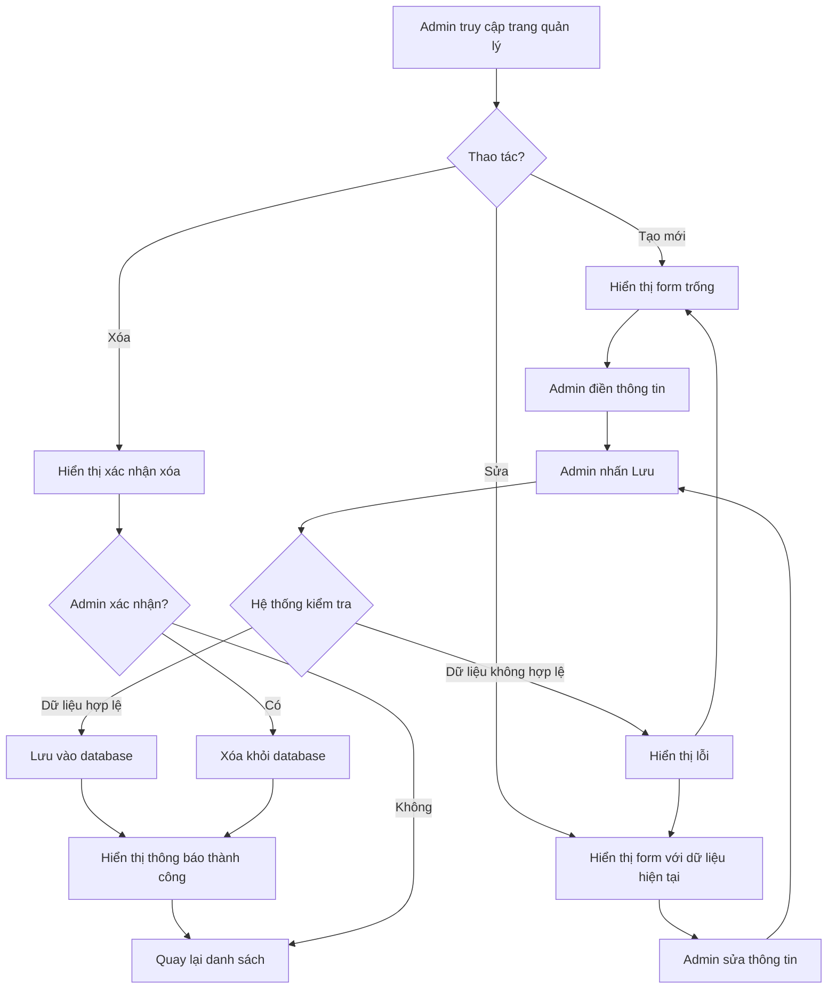

# TÀI LIỆU MÔ TẢ HỆ THỐNG
## Hệ thống Quản lý Khách sạn - Sanas

---

## **1. Giới thiệu hệ thống**

### **1.1. Mục tiêu hệ thống**

Hệ thống Quản lý Khách sạn (Sanas) là một ứng dụng web được phát triển bằng ASP.NET MVC, nhằm mục đích:

- Cung cấp nền tảng trực tuyến cho khách hàng tìm kiếm, xem thông tin và đặt phòng tại các resort/khách sạn
- Hỗ trợ quản trị viên quản lý toàn bộ hoạt động kinh doanh: resort, phòng, đơn đặt phòng, khách hàng
- Tối ưu hóa quy trình đặt phòng, quản lý tài nguyên và theo dõi doanh thu

### **1.2. Đối tượng sử dụng**

Hệ thống phục vụ 3 nhóm người dùng chính:

1. **Khách hàng (Customer)**: Người dùng cuối có nhu cầu tìm kiếm và đặt phòng
2. **Quản trị viên (Admin)**: Nhân viên quản lý hệ thống, có quyền truy cập đầy đủ các chức năng quản trị
3. **Đối tác (Partner)**: Chủ sở hữu resort (đã có trong cơ sở dữ liệu nhưng chưa có giao diện riêng)

### **1.3. Phạm vi chức năng**

**Phía khách hàng:**
- Đăng ký, đăng nhập, quản lý tài khoản
- Tìm kiếm và lọc resort/phòng theo nhiều tiêu chí
- Xem chi tiết resort và phòng
- Đặt phòng trực tuyến
- Xem lịch sử đặt phòng

**Phía quản trị:**
- Dashboard thống kê doanh thu và đơn hàng
- Quản lý resort (thêm, sửa, xóa, xem danh sách)
- Quản lý phòng (thêm, sửa, xóa, xem danh sách)
- Quản lý đơn đặt phòng (xem, cập nhật trạng thái)
- Quản lý khách hàng (CRUD)
- Quản lý blog
- Xem lịch đặt phòng (Calendar)
- Cấu hình hệ thống

### **1.4. Quy trình tổng quan hệ thống**

```
┌─────────────────────────────────────────────────────────────┐
│                    QUY TRÌNH TỔNG QUAN                      │
└─────────────────────────────────────────────────────────────┘

1. Khách hàng truy cập trang chủ
   ↓
2. Tìm kiếm resort/phòng (theo địa điểm, ngày check-in/out, giá, số người)
   ↓
3. Xem danh sách phòng phù hợp
   ↓
4. Xem chi tiết phòng và resort
   ↓
5. Đăng nhập/Đăng ký (nếu chưa có tài khoản)
   ↓
6. Điền thông tin đặt phòng
   ↓
7. Xác nhận và hoàn tất đặt phòng
   ↓
8. Admin xem và xử lý đơn đặt phòng (cập nhật trạng thái, thanh toán)
```

---

## **2. Danh sách nhóm người dùng**

### **2.1. Nhóm người dùng Khách hàng**

#### **Vai trò**
Người dùng cuối sử dụng hệ thống để tìm kiếm và đặt phòng tại các resort/khách sạn.

#### **Mô tả ngắn về nhóm**
Khách hàng là những người có nhu cầu đặt phòng nghỉ dưỡng. Họ có thể duyệt danh sách resort, tìm kiếm phòng phù hợp, xem chi tiết và thực hiện đặt phòng. Tài khoản khách hàng được tạo thông qua chức năng đăng ký, với các trường `is_admin = false` và `is_partner = false` trong bảng `Customers`.

#### **Các chức năng có thể sử dụng**

**Sơ đồ phân cấp chức năng dạng cây:**

```
Khách hàng
 ├─ Đăng ký tài khoản
 ├─ Đăng nhập / Quên mật khẩu
 ├─ Đăng xuất
 ├─ Xem trang chủ
 ├─ Tìm kiếm resort/phòng
 │   ├─ Tìm theo địa điểm
 │   ├─ Lọc theo ngày check-in/check-out
 │   ├─ Lọc theo khoảng giá
 │   ├─ Lọc theo số người lớn/trẻ em
 │   └─ Sắp xếp kết quả
 ├─ Xem danh sách phòng
 ├─ Xem chi tiết phòng
 │   ├─ Xem thông tin phòng
 │   ├─ Xem thông tin resort
 │   └─ Xem phòng liên quan
 ├─ Đặt phòng
 │   ├─ Nhập thông tin liên hệ
 │   ├─ Xác nhận thông tin
 │   └─ Hoàn tất đặt phòng
 ├─ Xem thông tin cá nhân
 └─ Xem lịch sử đặt phòng
```

---

### **2.2. Nhóm người dùng Nhân viên (Admin)**

#### **Vai trò**
Quản trị viên hệ thống, có quyền truy cập và quản lý toàn bộ dữ liệu và chức năng của hệ thống.

#### **Mô tả nhiệm vụ**
Quản trị viên chịu trách nhiệm:
- Quản lý nội dung: resort, phòng, blog
- Xử lý đơn đặt phòng: xem, cập nhật trạng thái, thanh toán
- Quản lý người dùng: khách hàng, phân quyền
- Theo dõi và báo cáo: doanh thu, thống kê đơn hàng
- Cấu hình hệ thống

Tài khoản admin được xác định bởi trường `is_admin = true` trong bảng `Customers`. Tất cả các controller trong Area `Admin` đều được bảo vệ bởi attribute `[AdminAuthorize]`.

#### **Các chức năng được phân quyền theo nghiệp vụ**

**Sơ đồ phân cấp chức năng dạng cây:**

```
Nhân viên (Admin)
 ├─ Dashboard
 │   ├─ Xem thống kê doanh thu
 │   ├─ Xem số lượng đơn hàng
 │   ├─ Xem số lượng khách hàng
 │   └─ Lọc theo resort và khoảng thời gian
 ├─ Quản lý Resort
 │   ├─ Xem danh sách resort
 │   ├─ Tạo resort mới
 │   ├─ Sửa thông tin resort
 │   ├─ Xóa resort
 │   └─ Xem chi tiết resort
 ├─ Quản lý Phòng
 │   ├─ Xem danh sách phòng
 │   ├─ Tạo phòng mới
 │   ├─ Sửa thông tin phòng
 │   ├─ Xóa phòng
 │   └─ Xem chi tiết phòng
 ├─ Quản lý Đơn hàng
 │   ├─ Xem danh sách đơn hàng
 │   ├─ Lọc đơn hàng (theo resort, trạng thái, thời gian)
 │   ├─ Xem chi tiết đơn hàng
 │   └─ Cập nhật trạng thái đơn hàng
 ├─ Quản lý Khách hàng
 │   ├─ Xem danh sách khách hàng
 │   ├─ Tạo tài khoản khách hàng
 │   ├─ Sửa thông tin khách hàng
 │   ├─ Xóa khách hàng
 │   └─ Xem chi tiết khách hàng
 ├─ Quản lý Blog
 │   ├─ Xem danh sách bài viết
 │   ├─ Tạo bài viết mới
 │   ├─ Sửa bài viết
 │   ├─ Xóa bài viết
 │   └─ Quản lý trạng thái bài viết
 ├─ Calendar
 │   └─ Xem lịch đặt phòng
 └─ Cấu hình hệ thống
     └─ Quản lý settings
```

---

## **3. Chi tiết chức năng**

### **3.1. Đăng ký tài khoản**

- **Tên chức năng**: Đăng ký tài khoản (Register)
- **Mục đích**: Cho phép người dùng mới tạo tài khoản trong hệ thống
- **Mô tả chi tiết logic**:
  - Người dùng nhập thông tin: tên, email, mật khẩu, xác nhận mật khẩu
  - Hệ thống kiểm tra:
    - Tất cả các trường bắt buộc không được để trống
    - Mật khẩu và xác nhận mật khẩu phải khớp
    - Email chưa được sử dụng trong hệ thống
  - Nếu hợp lệ, tạo bản ghi mới trong bảng `Customers` với `is_admin = false`, `is_partner = false`
  - Chuyển hướng đến trang đăng nhập
- **Luồng thao tác người dùng (User Flow)**:
  1. Truy cập `/Account/Register`
  2. Điền form: Name, Email, Password, Confirm Password
  3. Nhấn nút "Đăng ký"
  4. Hệ thống kiểm tra và hiển thị thông báo lỗi (nếu có) hoặc chuyển đến trang đăng nhập
- **Quyền nào được phép truy cập**: Tất cả người dùng (không cần đăng nhập)
- **Output / Outcome**: Tài khoản mới được tạo, người dùng có thể đăng nhập
- **Ràng buộc dữ liệu**:
  - Email: không được trùng, định dạng hợp lệ
  - Password: không được để trống
  - Name: không được để trống
- **Trường hợp ngoại lệ**:
  - Email đã tồn tại → Hiển thị lỗi "Email này đã được đăng ký"
  - Mật khẩu không khớp → Hiển thị lỗi "Xác nhận mật khẩu không khớp"
  - Thiếu thông tin bắt buộc → Hiển thị lỗi "Vui lòng nhập đầy đủ thông tin"

---

### **3.2. Đăng nhập**

- **Tên chức năng**: Đăng nhập (Login)
- **Mục đích**: Xác thực người dùng và cấp quyền truy cập hệ thống
- **Mô tả chi tiết logic**:
  - Người dùng nhập email và mật khẩu
  - Hệ thống tìm kiếm trong bảng `Customers` với điều kiện `email` và `password` khớp
  - Nếu tìm thấy:
    - Lưu thông tin người dùng vào Session `["User"]`
    - Nếu chọn "Nhớ đăng nhập", tạo cookie `remember_token` và lưu vào database
    - Kiểm tra `is_admin`:
      - Nếu `true` → Chuyển đến `/Admin/Dashboard`
      - Nếu `false` → Chuyển đến `/HomePage/Index`
  - Nếu không tìm thấy → Hiển thị lỗi
- **Luồng thao tác người dùng (User Flow)**:
  1. Truy cập `/Account/Login`
  2. Nhập Email và Password
  3. (Tùy chọn) Chọn "Nhớ đăng nhập"
  4. Nhấn nút "Đăng nhập"
  5. Hệ thống xác thực và chuyển hướng
- **Quyền nào được phép truy cập**: Tất cả người dùng
- **Output / Outcome**: Session được tạo, người dùng được chuyển đến trang phù hợp
- **Ràng buộc dữ liệu**:
  - Email và Password không được để trống
  - Email và Password phải khớp với dữ liệu trong database
- **Trường hợp ngoại lệ**:
  - Email hoặc mật khẩu sai → Hiển thị lỗi "Email hoặc mật khẩu không đúng!"
  - Người dùng đã đăng nhập → Tự động chuyển đến trang chủ

---

### **3.3. Tìm kiếm và lọc phòng**

- **Tên chức năng**: Tìm kiếm và lọc phòng (Room Search & Filter)
- **Mục đích**: Cho phép khách hàng tìm kiếm phòng phù hợp với nhu cầu
- **Mô tả chi tiết logic**:
  - Người dùng nhập các tiêu chí tìm kiếm:
    - Địa điểm (tìm trong tên phòng, mô tả, địa chỉ resort)
    - Ngày check-in và check-out
    - Khoảng giá (từ - đến)
    - Số người lớn, trẻ em
    - Số lượng phòng còn trống
  - Hệ thống lọc phòng:
    - Lọc theo resort (nếu có `resortId`)
    - Tìm kiếm theo từ khóa trong tên, mô tả, địa chỉ
    - Lọc theo khoảng giá
    - Lọc theo số người (adults, children)
    - Kiểm tra phòng còn trống trong khoảng thời gian đã chọn (tránh trùng với booking đã có)
    - Sắp xếp: giá tăng dần, giá giảm dần, mặc định
  - Phân trang: 12 phòng mỗi trang
- **Luồng thao tác người dùng (User Flow)**:
  1. Truy cập `/Room/Index` hoặc từ trang chủ
  2. Nhập các tiêu chí tìm kiếm vào form
  3. Nhấn nút "Tìm kiếm"
  4. Xem danh sách kết quả
  5. Có thể thay đổi bộ lọc và tìm lại
- **Quyền nào được phép truy cập**: Tất cả người dùng (không cần đăng nhập)
- **Output / Outcome**: Danh sách phòng phù hợp với tiêu chí, có phân trang
- **Ràng buộc dữ liệu**:
  - Ngày check-out phải sau ngày check-in
  - Ngày check-in không được trong quá khứ
- **Trường hợp ngoại lệ**:
  - Không tìm thấy phòng nào → Hiển thị thông báo "Không có kết quả"
  - Ngày không hợp lệ → Sử dụng giá trị mặc định (ngày mai và ngày kế tiếp)

---

### **3.4. Xem chi tiết phòng**

- **Tên chức năng**: Xem chi tiết phòng (Room Details)
- **Mục đích**: Hiển thị thông tin đầy đủ về phòng và resort để khách hàng quyết định đặt phòng
- **Mô tả chi tiết logic**:
  - Hiển thị thông tin phòng: tên, giá, mô tả, hình ảnh, tiện ích, số người tối đa
  - Hiển thị thông tin resort: tên, địa chỉ, bản đồ, mô tả, tiện ích chung
  - Tính toán số phòng còn trống trong khoảng thời gian đã chọn
  - Hiển thị các phòng liên quan (cùng resort, giới hạn 6 phòng)
- **Luồng thao tác người dùng (User Flow)**:
  1. Từ danh sách phòng, nhấn vào một phòng
  2. Xem chi tiết phòng và resort
  3. Chọn ngày check-in và check-out (nếu chưa chọn)
  4. Nhấn nút "Đặt phòng"
  5. Chuyển đến trang đặt phòng
- **Quyền nào được phép truy cập**: Tất cả người dùng
- **Output / Outcome**: Trang chi tiết phòng với đầy đủ thông tin
- **Ràng buộc dữ liệu**: ID phòng phải tồn tại trong database
- **Trường hợp ngoại lệ**:
  - Phòng không tồn tại → Hiển thị lỗi 404
  - Phòng đã hết chỗ trong khoảng thời gian → Hiển thị thông báo

---

### **3.5. Đặt phòng**

- **Tên chức năng**: Đặt phòng (Booking)
- **Mục đích**: Cho phép khách hàng đặt phòng sau khi đã chọn phòng và ngày
- **Mô tả chi tiết logic**:
  - **Bước 1 (Book)**: Người dùng nhập thông tin liên hệ (tên, email, số điện thoại)
  - **Bước 2 (Confirm)**: Hiển thị thông tin xác nhận và tổng giá
    - Tính số ngày: `(checkout - checkin).TotalDays`
    - Tính tổng giá: `số ngày × giá phòng`
  - **Bước 3 (Success)**: Lưu đơn đặt phòng
    - Kiểm tra lại phòng còn trống (tránh trùng với booking khác trong cùng khoảng thời gian)
    - Tạo bản ghi mới trong bảng `Bookings` với:
      - `status = "pending"`
      - `payment_status = "unpaid"`
      - `note = "Thanh toán sau"`
    - Hiển thị trang thành công
- **Luồng thao tác người dùng (User Flow)**:
  1. Từ trang chi tiết phòng, nhấn "Đặt phòng"
  2. (Nếu chưa đăng nhập) Chuyển đến trang đăng nhập
  3. Nhập thông tin liên hệ
  4. Xem xác nhận và tổng giá
  5. Xác nhận đặt phòng
  6. Xem trang thành công
- **Quyền nào được phép truy cập**: Chỉ người dùng đã đăng nhập
- **Output / Outcome**: Đơn đặt phòng được tạo với trạng thái "pending"
- **Ràng buộc dữ liệu**:
  - Phải đăng nhập
  - Ngày check-in và check-out phải hợp lệ
  - Phòng phải còn trống trong khoảng thời gian đã chọn
  - Tên, email, số điện thoại không được để trống
- **Trường hợp ngoại lệ**:
  - Chưa đăng nhập → Chuyển đến trang đăng nhập
  - Phòng đã hết chỗ → Hiển thị lỗi và chuyển về trang danh sách phòng
  - Ngày không hợp lệ → Hiển thị lỗi 404

---

### **3.6. Xem thông tin cá nhân và lịch sử đặt phòng**

- **Tên chức năng**: Xem thông tin cá nhân (Profile)
- **Mục đích**: Cho phép khách hàng xem và quản lý thông tin cá nhân, xem lịch sử đặt phòng
- **Mô tả chi tiết logic**:
  - Lấy thông tin người dùng từ Session
  - Lấy danh sách đơn đặt phòng của người dùng từ bảng `Bookings` (sắp xếp theo ngày tạo mới nhất)
  - Hiển thị thông tin người dùng và danh sách đơn hàng
- **Luồng thao tác người dùng (User Flow)**:
  1. Đăng nhập
  2. Truy cập `/Account/Profile`
  3. Xem thông tin cá nhân
  4. Xem danh sách đơn đặt phòng
- **Quyền nào được phép truy cập**: Chỉ người dùng đã đăng nhập
- **Output / Outcome**: Trang hiển thị thông tin cá nhân và lịch sử đặt phòng
- **Ràng buộc dữ liệu**: Phải đăng nhập
- **Trường hợp ngoại lệ**:
  - Chưa đăng nhập → Chuyển đến trang đăng nhập

---

### **3.7. Dashboard (Admin)**

- **Tên chức năng**: Dashboard quản trị
- **Mục đích**: Cung cấp cái nhìn tổng quan về hoạt động kinh doanh
- **Mô tả chi tiết logic**:
  - Lọc dữ liệu theo khoảng thời gian (mặc định 30 ngày gần nhất) và resort (tùy chọn)
  - Tính toán các chỉ số:
    - **Doanh thu dự kiến**: Tổng giá trị đơn hàng có trạng thái "confirmed" hoặc "completed"
    - **Doanh thu thực tế**: Tổng giá trị đơn hàng đã thanh toán (`payment_status = "paid"`)
    - **Tổng số đơn hàng**: Số lượng booking (loại trừ đơn hủy)
    - **Tổng số khách hàng**: Số lượng khách hàng duy nhất đã đặt phòng
  - Gom dữ liệu doanh thu theo ngày để vẽ biểu đồ
- **Luồng thao tác người dùng (User Flow)**:
  1. Đăng nhập với tài khoản admin
  2. Truy cập `/Admin/Dashboard`
  3. (Tùy chọn) Chọn khoảng thời gian và resort để lọc
  4. Xem các chỉ số thống kê và biểu đồ
- **Quyền nào được phép truy cập**: Chỉ admin (`is_admin = true`)
- **Output / Outcome**: Trang dashboard với các chỉ số và biểu đồ doanh thu
- **Ràng buộc dữ liệu**: Phải là admin
- **Trường hợp ngoại lệ**:
  - Không phải admin → Chuyển về trang chủ

---

### **3.8. Quản lý Resort (Admin)**

- **Tên chức năng**: Quản lý Resort
- **Mục đích**: Cho phép admin quản lý thông tin các resort trong hệ thống
- **Mô tả chi tiết logic**:
  - **Xem danh sách**: Hiển thị danh sách resort với thông tin: tên, địa chỉ, giá min/max, ngày tạo/cập nhật
  - **Tạo mới**: Nhập thông tin resort (tên, địa chỉ, mô tả, bản đồ, hình ảnh, tiện ích, chọn manager/partner)
  - **Sửa**: Cập nhật thông tin resort
  - **Xóa**: Xóa resort khỏi hệ thống
- **Luồng thao tác người dùng (User Flow)**:
  1. Truy cập `/Admin/Resort/Index`
  2. Xem danh sách resort
  3. (Tạo mới) Nhấn "Tạo mới" → Điền form → Lưu
  4. (Sửa) Nhấn "Sửa" → Cập nhật thông tin → Lưu
  5. (Xóa) Nhấn "Xóa" → Xác nhận
- **Quyền nào được phép truy cập**: Chỉ admin
- **Output / Outcome**: Quản lý thành công resort
- **Ràng buộc dữ liệu**:
  - Tên và slug không được để trống
  - Slug phải duy nhất
- **Trường hợp ngoại lệ**:
  - Slug trùng → Hiển thị lỗi
  - Resort không tồn tại → Hiển thị lỗi 404

---

### **3.9. Quản lý Đơn hàng (Admin)**

- **Tên chức năng**: Quản lý Đơn hàng (Order Management)
- **Mục đích**: Cho phép admin xem và xử lý các đơn đặt phòng
- **Mô tả chi tiết logic**:
  - **Xem danh sách**: Hiển thị danh sách đơn hàng với thông tin: khách hàng, resort, phòng, ngày check-in/out, tổng giá, trạng thái, trạng thái thanh toán
  - **Lọc**: Theo khoảng thời gian, resort, trạng thái đơn hàng
  - **Xem chi tiết**: Hiển thị đầy đủ thông tin đơn hàng
  - **Cập nhật**: Sửa trạng thái đơn hàng (`pending`, `confirmed`, `completed`, `cancelled`) và trạng thái thanh toán (`unpaid`, `paid`)
- **Luồng thao tác người dùng (User Flow)**:
  1. Truy cập `/Admin/Order/Index`
  2. (Tùy chọn) Chọn bộ lọc
  3. Xem danh sách đơn hàng
  4. Nhấn vào một đơn hàng để xem chi tiết
  5. (Nếu cần) Cập nhật trạng thái và lưu
- **Quyền nào được phép truy cập**: Chỉ admin
- **Output / Outcome**: Quản lý thành công đơn hàng
- **Ràng buộc dữ liệu**: Đơn hàng phải tồn tại
- **Trường hợp ngoại lệ**:
  - Đơn hàng không tồn tại → Hiển thị lỗi

---

### **3.10. Quản lý Khách hàng (Admin)**

- **Tên chức năng**: Quản lý Khách hàng (Customer Management)
- **Mục đích**: Cho phép admin quản lý tài khoản khách hàng
- **Mô tả chi tiết logic**:
  - **Xem danh sách**: Hiển thị danh sách khách hàng (sắp xếp theo ngày tạo mới nhất)
  - **Tạo mới**: Tạo tài khoản khách hàng mới (có thể upload avatar)
  - **Sửa**: Cập nhật thông tin khách hàng (tên, email, số điện thoại, địa chỉ, avatar, phân quyền)
  - **Xóa**: Xóa tài khoản khách hàng (không được xóa chính mình)
- **Luồng thao tác người dùng (User Flow)**:
  1. Truy cập `/Admin/Customer/Index`
  2. Xem danh sách khách hàng
  3. (Tạo mới) Nhấn "Tạo mới" → Điền form → Lưu
  4. (Sửa) Nhấn "Sửa" → Cập nhật → Lưu
  5. (Xóa) Nhấn "Xóa" → Xác nhận
- **Quyền nào được phép truy cập**: Chỉ admin
- **Output / Outcome**: Quản lý thành công khách hàng
- **Ràng buộc dữ liệu**:
  - Email không được trùng
  - Mật khẩu (nếu thay đổi) phải có ít nhất 6 ký tự
  - Không được xóa chính mình
- **Trường hợp ngoại lệ**:
  - Email trùng → Hiển thị lỗi "Email already in use"
  - Xóa chính mình → Hiển thị lỗi "Delete action failed"
  - Khách hàng không tồn tại → Hiển thị lỗi

---

## **4. Mô tả luồng xử lý (Workflow)**

### **4.1. Luồng đăng nhập**



---

### **4.2. Luồng đặt dịch vụ**



---

### **4.3. Luồng xử lý từ nhân viên (Admin xử lý đơn hàng)**



---

### **4.4. Luồng phê duyệt (Cập nhật trạng thái đơn hàng)**



---

### **4.5. Luồng cập nhật dữ liệu (Admin quản lý Resort/Phòng)**



---

## **5. Danh sách bảng dữ liệu chính**

### **5.1. Bảng Customers**

- **Tên bảng**: `Customers`
- **Mục đích**: Lưu trữ thông tin người dùng (khách hàng, admin, partner)
- **Các trường quan trọng**:
  - `id` (BigInt, Primary Key, Identity): ID duy nhất
  - `email` (NVarChar(255), NOT NULL): Email đăng nhập
  - `password` (VarChar(255), NOT NULL): Mật khẩu
  - `name` (NVarChar(255), NOT NULL): Tên người dùng
  - `phone` (VarChar(20)): Số điện thoại
  - `is_admin` (Bit): Cờ xác định quyền admin
  - `is_partner` (Bit): Cờ xác định quyền partner
  - `status` (VarChar(255)): Trạng thái tài khoản
  - `avatar` (VarChar(255)): Đường dẫn ảnh đại diện
  - `birthday` (Date): Ngày sinh
  - `gender` (Bit): Giới tính
  - `address` (NVarChar(255)): Địa chỉ
  - `cash` (Decimal(19,2)): Số dư tài khoản
  - `remember_token` (VarChar(255)): Token nhớ đăng nhập
  - `created_at` (DateTime): Ngày tạo
  - `updated_at` (DateTime): Ngày cập nhật
- **Mối quan hệ**:
  - Một Customer có nhiều Resorts (1-N)
  - Một Customer có nhiều Feedbacks (1-N)
- **Ràng buộc**:
  - Email phải duy nhất
  - Email và password không được NULL

---

### **5.2. Bảng Resorts**

- **Tên bảng**: `Resorts`
- **Mục đích**: Lưu trữ thông tin các resort/khách sạn
- **Các trường quan trọng**:
  - `id` (BigInt, Primary Key, Identity): ID duy nhất
  - `slug` (VarChar(255), NOT NULL): URL-friendly identifier
  - `customer_id` (BigInt, NOT NULL, Foreign Key): ID chủ sở hữu (partner)
  - `name` (NVarChar(255), NOT NULL): Tên resort
  - `address` (NVarChar(255)): Địa chỉ
  - `map` (NVarChar(MAX)): Embed map hoặc tọa độ
  - `description` (NVarChar(MAX)): Mô tả
  - `images` (NVarChar(MAX)): Danh sách hình ảnh (JSON hoặc comma-separated)
  - `thumbnail` (NVarChar(MAX)): Ảnh đại diện
  - `general_amenities` (NVarChar(MAX)): Tiện ích chung (JSON hoặc comma-separated)
  - `status` (VarChar(20), NOT NULL): Trạng thái (active/inactive)
  - `created_at` (DateTime): Ngày tạo
  - `updated_at` (DateTime): Ngày cập nhật
- **Mối quan hệ**:
  - Một Resort thuộc về một Customer (partner) (N-1)
  - Một Resort có nhiều Rooms (1-N)
  - Một Resort có nhiều Bookings (1-N)
  - Một Resort có nhiều Feedbacks (1-N)
- **Ràng buộc**:
  - Slug phải duy nhất
  - Name không được NULL
  - customer_id phải tồn tại trong bảng Customers

---

### **5.3. Bảng Rooms**

- **Tên bảng**: `Rooms`
- **Mục đích**: Lưu trữ thông tin các phòng trong resort
- **Các trường quan trọng**:
  - `id` (BigInt, Primary Key, Identity): ID duy nhất
  - `resort_id` (BigInt, NOT NULL, Foreign Key): ID resort
  - `name` (NVarChar(255)): Tên phòng
  - `price` (Decimal(10,2)): Giá phòng
  - `quantity` (Int): Số lượng phòng
  - `description` (NVarChar(MAX)): Mô tả
  - `images` (NVarChar(MAX)): Danh sách hình ảnh
  - `thumbnail` (NVarChar(MAX)): Ảnh đại diện
  - `room_amenities` (NVarChar(MAX)): Tiện ích phòng (JSON hoặc comma-separated)
  - `number_of_adults` (Int): Số người lớn tối đa
  - `number_of_children` (Int): Số trẻ em tối đa
  - `status` (VarChar(255), NOT NULL): Trạng thái
  - `created_at` (DateTime): Ngày tạo
  - `updated_at` (DateTime): Ngày cập nhật
- **Mối quan hệ**:
  - Một Room thuộc về một Resort (N-1)
  - Một Room có nhiều Bookings (1-N)
- **Ràng buộc**:
  - resort_id phải tồn tại trong bảng Resorts
  - quantity >= 0

---

### **5.4. Bảng Bookings**

- **Tên bảng**: `Bookings`
- **Mục đích**: Lưu trữ thông tin đơn đặt phòng
- **Các trường quan trọng**:
  - `id` (BigInt, Primary Key, Identity): ID duy nhất
  - `customer_id` (Int, Foreign Key): ID khách hàng (nullable - có thể đặt không cần tài khoản)
  - `resort_id` (BigInt, NOT NULL, Foreign Key): ID resort
  - `room_id` (BigInt, NOT NULL, Foreign Key): ID phòng
  - `check_in` (Date, NOT NULL): Ngày nhận phòng
  - `check_out` (Date, NOT NULL): Ngày trả phòng
  - `total_price` (Decimal(10,2)): Tổng giá
  - `total_price_temporary` (Decimal(10,2)): Giá tạm tính
  - `status` (VarChar(20)): Trạng thái đơn hàng (pending, confirmed, completed, cancelled)
  - `payment_status` (VarChar(20)): Trạng thái thanh toán (unpaid, paid)
  - `note` (NVarChar(MAX)): Ghi chú
  - `name` (NVarChar(255)): Tên người đặt
  - `email` (VarChar(255)): Email người đặt
  - `phone` (VarChar(15)): Số điện thoại
  - `created_at` (DateTime): Ngày tạo
  - `updated_at` (DateTime): Ngày cập nhật
- **Mối quan hệ**:
  - Một Booking thuộc về một Customer (N-1, nullable)
  - Một Booking thuộc về một Resort (N-1)
  - Một Booking thuộc về một Room (N-1)
- **Ràng buộc**:
  - check_out phải sau check_in
  - resort_id và room_id phải tồn tại
  - Tránh trùng booking trong cùng khoảng thời gian cho cùng một phòng

---

### **5.5. Bảng Feedbacks**

- **Tên bảng**: `Feedbacks`
- **Mục đích**: Lưu trữ đánh giá và nhận xét của khách hàng về resort
- **Các trường quan trọng**:
  - `id` (BigInt, Primary Key, Identity): ID duy nhất
  - `customer_id` (BigInt, NOT NULL, Foreign Key): ID khách hàng
  - `resort_id` (BigInt, NOT NULL, Foreign Key): ID resort
  - `rate` (TinyInt): Điểm đánh giá (1-5)
  - `comment` (NVarChar(MAX)): Nhận xét
  - `created_at` (DateTime): Ngày tạo
  - `updated_at` (DateTime): Ngày cập nhật
- **Mối quan hệ**:
  - Một Feedback thuộc về một Customer (N-1)
  - Một Feedback thuộc về một Resort (N-1)
- **Ràng buộc**:
  - customer_id và resort_id phải tồn tại
  - rate thường trong khoảng 1-5

---

### **5.6. Bảng Blogs**

- **Tên bảng**: `Blogs`
- **Mục đích**: Lưu trữ các bài viết blog
- **Các trường quan trọng**:
  - `id` (BigInt, Primary Key, Identity): ID duy nhất
  - `slug` (VarChar(255), NOT NULL): URL-friendly identifier
  - `title` (NVarChar(255), NOT NULL): Tiêu đề
  - `content` (NVarChar(MAX), NOT NULL): Nội dung
  - `thumbnail` (VarChar(255)): Ảnh đại diện
  - `status` (VarChar(20), NOT NULL): Trạng thái (active/inactive)
  - `views` (Int, NOT NULL): Số lượt xem
  - `created_at` (DateTime, NOT NULL): Ngày tạo
  - `updated_at` (DateTime, NOT NULL): Ngày cập nhật
- **Mối quan hệ**: Không có quan hệ trực tiếp với các bảng khác
- **Ràng buộc**:
  - Slug phải duy nhất
  - Title và content không được NULL

---

## **6. Phân quyền (User Permissions Matrix)**

| Chức năng                    | Khách hàng | Nhân viên (Admin) | Partner |
|------------------------------|------------|------------------|---------|
| **Đăng ký tài khoản**        | ✔️         | ❌               | ❌      |
| **Đăng nhập**                | ✔️         | ✔️               | ✔️      |
| **Đăng xuất**                | ✔️         | ✔️               | ✔️      |
| **Xem trang chủ**             | ✔️         | ✔️               | ✔️      |
| **Tìm kiếm phòng**           | ✔️         | ✔️               | ✔️      |
| **Xem chi tiết phòng**       | ✔️         | ✔️               | ✔️      |
| **Đặt phòng**                | ✔️         | ❌               | ❌      |
| **Xem thông tin cá nhân**    | ✔️         | ❌               | ❌      |
| **Xem lịch sử đặt phòng**    | ✔️         | ❌               | ❌      |
| **Dashboard**                | ❌         | ✔️               | ❌      |
| **Quản lý Resort**           | ❌         | ✔️               | ❌      |
| **Quản lý Phòng**            | ❌         | ✔️               | ❌      |
| **Quản lý Đơn hàng**         | ❌         | ✔️               | ❌      |
| **Cập nhật trạng thái đơn**  | ❌         | ✔️               | ❌      |
| **Quản lý Khách hàng**       | ❌         | ✔️               | ❌      |
| **Quản lý Blog**             | ❌         | ✔️               | ❌      |
| **Xem Calendar**             | ❌         | ✔️               | ❌      |
| **Cấu hình hệ thống**        | ❌         | ✔️               | ❌      |

**Ghi chú:**
- Partner hiện tại chưa có giao diện riêng, chỉ có trong database
- Admin có thể thực hiện tất cả các chức năng của khách hàng
- Khách hàng chỉ có thể xem và đặt phòng, không thể quản lý

---

## **7. Phiên bản tài liệu**

### **7.1. Thông tin phiên bản**

- **Ngày tạo**: [Ngày hiện tại]
- **Người tạo**: Business Analyst
- **Phiên bản**: 1.0

### **7.2. Lịch sử cập nhật**

| Phiên bản | Ngày cập nhật | Người cập nhật | Mô tả thay đổi |
|-----------|---------------|----------------|----------------|
| 1.0       | [Ngày hiện tại] | Business Analyst | Tạo tài liệu ban đầu |

---

## **8. Phụ lục**

### **8.1. Các trạng thái đơn hàng (Booking Status)**

- `pending`: Đơn hàng mới tạo, chờ xử lý
- `confirmed`: Đơn hàng đã được xác nhận
- `completed`: Đơn hàng đã hoàn tất (khách đã check-out)
- `cancelled`: Đơn hàng đã bị hủy

### **8.2. Các trạng thái thanh toán (Payment Status)**

- `unpaid`: Chưa thanh toán
- `paid`: Đã thanh toán

### **8.3. Các trạng thái chung (Base Status)**

- `active`: Hoạt động
- `inactive`: Không hoạt động

### **8.4. Công nghệ sử dụng**

- **Framework**: ASP.NET MVC 5
- **Database**: SQL Server (LINQ to SQL)
- **Frontend**: HTML, CSS, JavaScript, Bootstrap 5
- **Authentication**: Session-based authentication
- **File Upload**: Hỗ trợ upload hình ảnh

---

